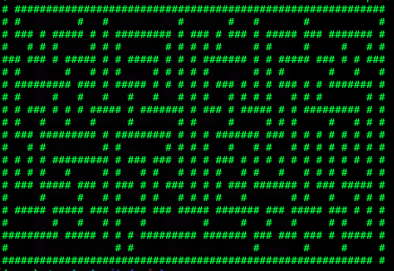
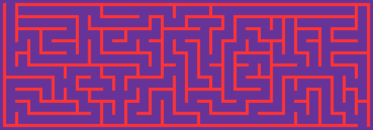
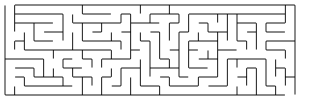

# Emmaze: Python library for generating and solving mazes

**WORK IN PROGRESS**: This is still a work in progress, and everything is
subject to change.

## Features

- Command-line script for making mazes.
- API for making mazes.
- Support for exporting to and importing from JSON.
- Generate as text-art, PNG, or SVG.

## Installation

- Requires Python 3.10.
- No pypi package yet (not ready for primetime), but you are welcome
  to clone/fork the repo and play with it, as provided by the
  [MIT License](LICENSE).

## Documentation/usage

- Documentation not hosted yet.
- Some documentation is written.
- `emmaze.py -h` will bring up rudimentary help.

## License

- [MIT](LICENSE)
