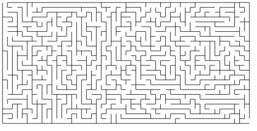
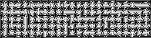
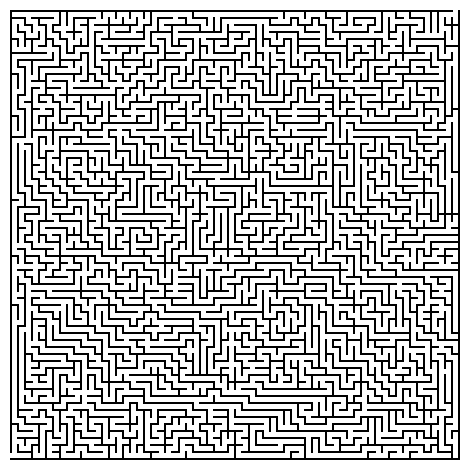
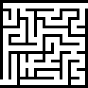
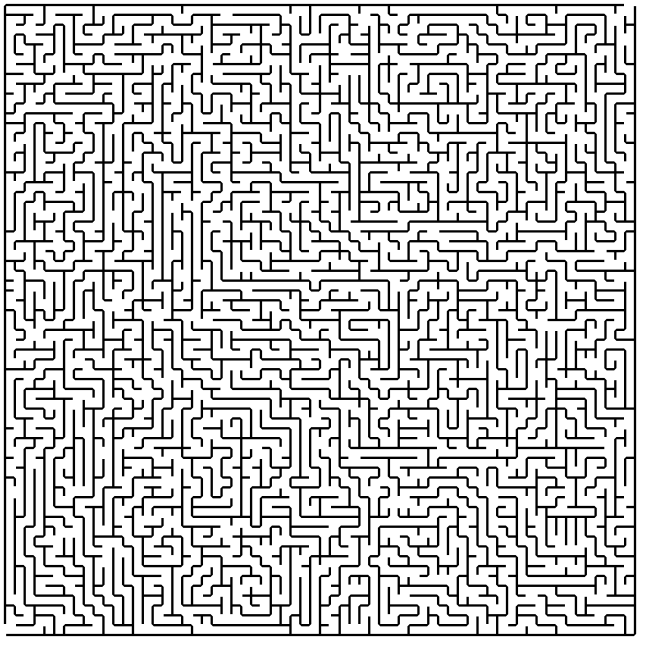
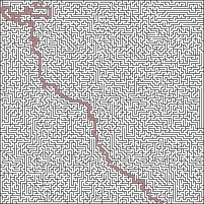
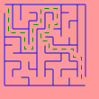
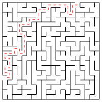

================
Using ``emmaze``
================

Introduction
------------

``emmaze`` is a maze library which comes with a command-line script. From the
terminal, you can produce random mazes in text-art, SVG, or PNG format.

Basic usage
-----------
``emmaze`` can be used from the command line. When run without any options, it
produces a 10 by 10 maze without any exits and prints the maze as text art to
the standard output.

.. code-block:: console

    $ ./emmaze.py
    #####################
    #     #             #
    ##### # ######### # #
    #   # #     #     # #
    # ### ##### # ##### #
    # # # #   # # # #   #
    # # # # # ### # #####
    # #     #     #     #
    # ####### # ##### # #
    #       # # #     # #
    # ##### # ### ### # #
    # #     #     # # # #
    # # ### # ##### # # #
    # # #   # #     # # #
    ### # ##### ### # # #
    #   #       # #   # #
    # ########### ##### #
    # #             #   #
    # ########### # # ###
    # #           #     #
    #####################

To change the number of rows and columns, use the ``-r [number]`` and ``-c
[number]`` options, respectively.

.. code-block:: console

    $ ./emmaze.py -r 5 -c 25
    ###################################################
    #     #   #   #   #   #               #         # #
    # ### # # # # ### # # # ############# # ####### # #
    #   # # #   #   #   # # #         #     #   #     #
    ### # # ### ### ##### # ### ##### ####### # # ### #
    # # #   #     #       #     #   #     # # #   # # #
    # # ######### ######### ##### # ##### # ####### # #
    # # #       #           #     #   # # #     #   # #
    # # ##### # ################# ### # # # ### # ### #
    #         #                   #     #   #     #   #
    ###################################################

Exits
-----
To make a maze with exits, use option ``--[direction]-exit [number]``, where
``[direction]`` is ``north``, ``south``, ``east``, or ``west``, and ``[number]``
is the location along the wall. For example, to place an exit in the 8th
location along the west wall, use ``--west-exit 8``. (Note the locations are
zero-indexed.)

.. code-block:: console

    $ ./emmaze.py -r 9 -c 25 --west-exit 8 --east-exit 0
    ###################################################
    #   #       #     #   # #                     #    
    ### ####### # ### ### # # ############# ##### # # #
    #         # # #       # # #           #     #   # #
    # ####### # # ######### # # # # ########### ##### #
    #   #             #     # # # # #   # # # # #     #
    ### ############# ### ### # # ### ### # # # ### ###
    # #           #           # #   # # # # # # # #   #
    # ########### ############### # # # # # # # # #####
    #         #                 # # #   #     #   #   #
    # # ####### ##### ######### # # # ### ####### ### #
    # #         #   #         # # # #   #       #     #
    # ########### # ### ##### # ### ### ##### #########
    # # #   #   # #     #     #   #   #               #
    # # # # ### # ####### # ### # ### ### ########### #
    # # # #     # #       # #   #     #   #   #     # #
    # # # ### ### ######### # ######### # ### ### # # #
        #   #     #         #           #       # #   #
    ###################################################

Output as graphics
------------------

Output as SVG
^^^^^^^^^^^^^
To output a maze as an SVG file, use the options ``-t svg -o [filename]``. 

.. code-block:: console

    $ ./emmaze.py -r 25 -c 50 --east-exit 24 --north-exit 0 -t svg -o maze1.svg
    $ file maze1.svg
    maze1.svg: SVG Scalable Vector Graphics image

The resulting file ``my_maze.svg`` will look something like this:

Output as PNG
^^^^^^^^^^^^^
To output the maze as a PNG file, use the options ``-t png -o [filename]``.

.. code-block:: console

    $ ./emmaze.py -r 32 -c 128 --west-exit 0 --south-exit 127 -t png -o maze2.png
    $ file maze2.png
    maze2.png: PNG image data, 257 x 65, 2-bit colormap, non-interlaced

The resulting file ``my_maze.svg`` will look something like this:

In the next section, we will see how to get a larger resulting PNG.

Customize cell, wall, and border size
-------------------------------------
The options ``--cell-size``, ``--wall-size``, and ``--border-size`` can be used
to change the size of the cells, walls, and border respectively. These options
work for text-art, SVG, and PNG mazes--except that the ``--border-size`` option
is ignored with SVG output.

Text-art output
^^^^^^^^^^^^^^^
For text-art output, these options control the size of features in characters.

.. code-block:: console

    $ ./emmaze.py -r 8 -c 8 --cell-size 1 --wall-size 1 --border-size 2 --north-exit 0 --east-exit 7
                         
                         
      # ###############  
      # #   #         #  
      # # # # ### ### #  
      # # #   #     # #  
      # ############# #  
      # #   #         #  
      # # # # #########  
      #   #   # #     #  
      ##### # # ##### #  
      #     # #     # #  
      # ##### ##### # #  
      #   # #     #   #  
      ### # ##### # # #  
      #   #     #   # #  
      # ### # ##### # #  
      # #   #       #    
      #################  
                         
                         
    $ ./emmaze.py -r 8 -c 8 --cell-size 3 --wall-size 2 --border-size 0 --north-exit 0 --east-exit 7
    ##   #####################################
    ##   #####################################
    ##   ##             ##   ##        ##   ##
    ##   ##             ##   ##        ##   ##
    ##   ##             ##   ##        ##   ##
    ##   ##   ##   ##   ##   ##   ##   ##   ##
    ##   ##   ##   ##   ##   ##   ##   ##   ##
    ##        ##   ##             ##        ##
    ##        ##   ##             ##        ##
    ##        ##   ##             ##        ##
    ##   ################################   ##
    ##   ################################   ##
    ##   ##                  ##        ##   ##
    ##   ##                  ##        ##   ##
    ##   ##                  ##        ##   ##
    ##   ##   ############   ##   ##   #######
    ##   ##   ############   ##   ##   #######
    ##        ##        ##        ##        ##
    ##        ##        ##        ##        ##
    ##        ##        ##        ##        ##
    #################   #######   ##   #######
    #################   #######   ##   #######
    ##   ##             ##   ##   ##        ##
    ##   ##             ##   ##   ##        ##
    ##   ##             ##   ##   ##        ##
    ##   ##   ##   ##   ##   ##   #######   ##
    ##   ##   ##   ##   ##   ##   #######   ##
    ##   ##   ##   ##        ##   ##        ##
    ##   ##   ##   ##        ##   ##        ##
    ##   ##   ##   ##        ##   ##        ##
    ##   #######   ############   ##   #######
    ##   #######   ############   ##   #######
    ##        ##                  ##   ##   ##
    ##        ##                  ##   ##   ##
    ##        ##                  ##   ##   ##
    ##   ###########################   ##   ##
    ##   ###########################   ##   ##
    ##                                        
    ##                                        
    ##                                        
    ##########################################
    ##########################################

Note that the cell size is the length or width between walls.

PNG output
^^^^^^^^^^
For PNG output, these sizes are instead given in pixels. For example, here is a
64 × 64 maze output as PNG with the options ``--cell-size 5 --wall-size 2
--border-size 10``:

Each wall is 2 pixels wide, the walls are 5 pixels apart, and there is a
10-pixel border around the maze (which is probably difficult to see).

By contrast, here is a 10 × 10 maze with the cell-size set to 8 and wall-size
set to 4:

SVG output
^^^^^^^^^^
For SVG output, the cell-size and wall-size are dimensionless, but they control
the ratio between elements of the maze. For example, if we set the cell-size to
15 and the wall-size to 2, we get a slightly different look than the defaults
(which are 19 and 1, respectively).

Solutions
---------
Solutions are generated with the ``--solutions`` option. If output to a file is
specified with ``-o [filename]``, the solutions are written to
``solution_[filename]``. Consider, for example, this command:

.. code-block:: console

    $ ./emmaze.py -r 100 -c 100 -t png -o maze6.png --cell-size 3 --wall-size 1 --solutions --north-exit 20 --south-exit 80

Output to ``solution_maze6.png`` will be something like the following:

Solutions can also be produced for text-art and SVG mazes.

.. code-block:: console

    $ ./emmaze.py -r 10 -c 15 --west-exit 0 --east-exit 9 --solutions
    ###############################
        #             #   #       #
    ### ##### ####### # # ##### # #
    #   #       #   # # #       # #
    # ### ### # # ### # ##### #####
    # #     # #     # #   #   #   #
    # # ### # ####### ### # # # # #
    # # #   #       # # # # #   # #
    # ### # ####### # # # # ##### #
    #     #   #   # # #   #   #   #
    ######### # ### # # ##### # # #
    #       #   #   # #   #   # # #
    ### ##### # # ### ######### # #
    # #       # # # #   #       # #
    # ##### ### # # ### # ####### #
    #     # #   #   #   # #     # #
    ##### ### ### # # ### ### ### #
    #   # #   # # # # #   #   #   #
    # # # # ### # # # # ### # # ###
    # #     #     # #   #   #      
    ###############################

    ###############################
     +++#    +++++++++#   #       #
    ###+#####+#######+# # ##### # #
    #+++#+++++  #   #+# #       # #
    #+###+### # # ###+# ##### #####
    #+#  +++# #     #+#   #   #   #
    #+# ###+# #######+### # # # # #
    #+# #+++#       #+# # # #   # #
    #+###+# ####### #+# # # ##### #
    #+++++#   #   # #+#   #   #+++#
    ######### # ### #+# ##### #+#+#
    #       #   #   #+#   #   #+#+#
    ### ##### # # ###+#########+#+#
    # #       # # # #+++#+++++++#+#
    # ##### ### # # ###+#+#######+#
    #     # #   #   #+++#+#     #+#
    ##### ### ### # #+###+### ###+#
    #   # #   # # # #+#+++#   #+++#
    # # # # ### # # #+#+### # #+###
    # #     #     # #+++#   #  +++ 
    ###############################

Customize colors
----------------

The options ``--cell-color``, ``--wall-color``, and ``--solution-color`` can be
used to customize the color output in SVG or PNG formats. Colors are specified
as hex-triplets (e.g. ``FF3333``).

.. code-block:: console

   $ ./emmaze.py -t svg --west-exit 0 --east-exit 9 -o maze8.svg --cell-color FF9999 --wall-color 0000FF --solution-color 00FF00 --solutions

The file ``solution_maze8.svg`` will look like this:

JSON support
------------
Mazes can be output and then later input in JSON format. To output as JSON, use
the options ``-t json -o [filename]``. To import, use the option
``-j [filename]``.

If the ``--solutions`` option is provided when generating JSON, the resulting
JSON file will also include the solutions.

.. code-block:: console

    $ ./emmaze.py -r 20 -c 20 --west-exit 15 --north-exit 15 --solutions -t json -o maze7.json
    $ file maze7.json
    maze7.json: JSON data
    $ ./emmaze.py -j maze7.json
    ############################### #########
    # #   #   #     #           #   #     # #
    # # # # ### ### ### ##### # # # ### # # #
    #   # #       #     # #   # # #     #   #
    ##### ######### ### # # ### # ######### #
    # # # #         #   #   #     #   #     #
    # # # # ####### # ### ######### ### #####
    #   #   # #     #   #     #   #       # #
    # ####### # ########### # ### ### ### # #
    #     #     # #         #   #     # # # #
    # ### # ##### # ######### # ### ### # # #
    #   # # #     # #   #     #   #   #     #
    # ##### ### ### # # # ####### ### ##### #
    #     #   #   # # #     #     #   #   # #
    ### # ### ### # ### ##### ######### # # #
    #   # # #     # #     #   #         # # #
    # # # # # ##### # ### # ####### ##### ###
    # # #   # #   # # #   # #     # #   # # #
    ####### # # # # # ### # # ### # # # # # #
    #       # # #   #   # #     #   # # #   #
    ##### # # # ####### # ##### ##### # #####
    #     #   # # #   # # # # # #     #   # #
    # ##### ### # # # # # # # # # # ### # # #
    #   #   #     # # # # #       # #   #   #
    ### # ### ##### ### # ##### ##### ### # #
    # # #   # # # #     #     #     #   # # #
    # # ### # # # # ######### ##### ### # # #
    #   # # # # # #     # #   #     #   # # #
    # ### # # # # ##### # # ### # # ### # ###
    #   # # # # #   #   # #   # # #   # #   #
    ### # # # # # ### ### ### # # ### # ### #
        #   #   #     #       # # #   #   # #
    # ### ##### # ######### ### # # ####### #
    # #   #   # #   #       #   # #     # # #
    # ##### # # ### # ####### ### ##### # # #
    #   #   #     # #   #       #     #   # #
    ### # ####### # # ### # ### ##### ### # #
    #   #   #     # # #   # # # #   # #   # #
    # # ##### ##### # ##### # ### ### # ### #
    # # #       #   # #       #       # #   #
    #########################################
    $ ./emmaze.py -j maze7.json --solutions -t svg -o maze7.svg

The corresponding file ``solutions_maze7.svg`` will look like this:

